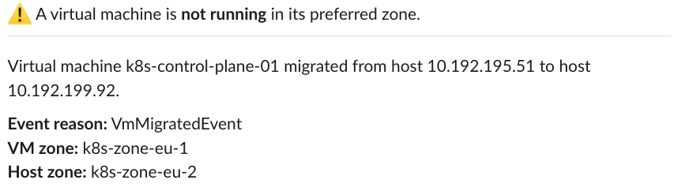
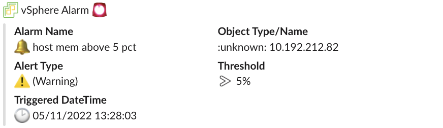

# Tutorial

Installation instructions and step-by-step examples for the Kubecon 2022 EU
session [`Optimize Kubernetes on vSphere with Event-Driven
Automation`](https://kccnceu2022.sched.com/event/yttR/optimize-kubernetes-on-vsphere-with-event-driven-automation-steven-wong-michael-gasch-vmware?iframe=no).

This tutorial uses and deploys the components of the [VMware Event Broker
Appliance](https://vmweventbroker.io/) (VEBA) directly on a Kubernetes
environment to *create reactive and event-driven solutions for common
operational use cases*, e.g. notification to 3rd party systems like Slack.

The solutions described here are meant to serve as an inspiration and starting
point. Because with VEBA, you are only limited by your imagination ;)

⚠️ Make sure to follow the [installation](#installing-required-components)
section before proceeding with the following scenarios.

This demo is tested with `vmware-veba/event-router v0.7.3` and Knative `v1.2.0`.

## Scenario: Slack notification on Tags/Label drift

VMware vSphere `categories` and `tags` are often used to identify and group
related resources, e.g. virtual machines running on the same
hosts/rack/datacenter.

Kubernetes can leverage vSphere `tags` and automatically [map
them](https://cloud-provider-vsphere.sigs.k8s.io/tutorials/deploying_cpi_with_multi_dc_vc_aka_zones.html)
to topology `labels`, e.g. `topology.kubernetes.io/zone`.

Mapping vSphere `tags` to Kubernetes `labels` ensures that both runtimes
(schedulers) have the same understanding of the underlying infrastructure and
topology.

However, due to the dynamic nature of a vSphere environment (vSphere DRS and
vSphere [proactive] HA), these mappings can get out of sync, often requiring
manual operator intervention.

### Solution

Deploy a function which sends a Slack notification when a virtual machine is not
running on the preferred host (i.e. `tag` mismatch).

🎥 [Video walkthrough (Youtube)](https://www.youtube.com/watch?v=2lilm9RTBdM)


### Setup the Scenario

If you haven't already done so, set up Slack Incoming Webhooks
([documentation](https://api.slack.com/messaging/webhooks)).

Create the appropriate vSphere zone `category` and associated `tags` (if not
already done so). This example uses the category `k8s-zone` and two zone `tags`
(`k8s-zone-eu-1` and `k8s-zone-eu-2`). This can be done with
[`govc`](https://github.com/vmware/govmomi/tree/master/govc) or through the
vCenter UI.

```bash
govc tags.category.create -d "Kubernetes zone" k8s-zone
govc tags.create -d "Kubernetes Zone EU-1" -c k8s-zone k8s-zone-eu-1
govc tags.create -d "Kubernetes Zone EU-2" -c k8s-zone k8s-zone-eu-2
```

Assign the `tags` to your virtual machines and hosts accordingly. For example,
below you can see that `tags` `k8s-zone-eu-1` and `k8s-zone-eu-2` are attached
to two hosts and one virtual machine each.

```bash
# EU-1
govc tags.attached.ls k8s-zone-eu-1
HostSystem:host-33
HostSystem:host-21
VirtualMachine:vm-56

# EU-2
govc tags.attached.ls k8s-zone-eu-2
HostSystem:host-15
HostSystem:host-27
VirtualMachine:vm-57
```

⚠️ This example function does not support `tags` on objects other than virtual
machines and hosts. See the hacking section
[below](#food-for-further-customization-hacking) for details.

Create a Kubernetes secret to store the Slack Webhook URL (token).

```bash
kubectl -n vmware-functions create secret generic slack-credentials --from-literal=token='https://your-token-value...'
```

Create the Kubernetes `vsphere-credentials` secret which will be used by the
function to connect to the vCenter Server to retrieve tag assignments.

```bash
kubectl -n vmware-functions create secret generic vsphere-credentials --from-literal=username='vcenter-username' --from-literal=password='vcenter-password'
```

Configure the function. Open the [function.yaml](tagdrift-fn/function.yaml) and
change the following values.

```yaml
- name: VCENTER_URL
  value: "https://your-vcenter..."
- name: VCENTER_INSECURE
  value: "true" # will not panic on self-signed certificates
- name: CATEGORY
  value: "k8s-zone" # change this if your zone category has a different name
```

Save and close the YAML file in the `tagdrift-fn` folder. Deploy the function.

```bash
cd tagdrift-fn
kubectl -n vmware-functions create -f function.yaml
kubectl -n vmware-functions wait --timeout=3m --for=condition=Ready ksvc/tagdrift-fn
```

Inspect the logs that the function is correctly running.

```bash
kubectl -n vmware-functions logs deploy/tagdrift-fn-00001-deployment  -c user-container
2022-05-12T12:13:08.475Z        INFO    tagdrift        tagdrift-fn/main.go:55  starting tagdrift function      {"commit": "862f6a31", "listenPort": 8080, "debug": true}
```

In case the function is not starting (pending), panicking (`CrashLoopBackoff`)
or throwing warnings/errors make sure that:

- The Kubernetes Slack `secret` was created as described above before creating the function
- The vSphere configuration values are correct
- You have sufficient permissions to connect to vCenter and send to Slack

If the function is working correctly, the following Slack message will be
posted.



### Build the Function

⚠️ This is only required if you made changes to the Go code.

The following descriptions assume a `kind` installation. Change the environment
values accordingly (also if you are not using `kind`).

```bash
export KIND_CLUSTER_NAME=kubeconeu22
export KO_DOCKER_REPO=kind.local
export KO_COMMIT=$(git rev-parse --short=8 HEAD)
```

Then build and push/load the image with [`ko`](https://github.com/google/ko).

```bash
cd tagdrift-fn
ko publish -B .
```


#### Food for further customization (hacking):

- Extend the function to retrieve VM `zone` object tags from higher-level
  objects, e.g. cluster/folder
- Send the notification to another system, e.g. Teams or PagerDuty
- Create a trigger for an HA event
- Extend the integration by having a Slack bot take action to migrate the VM
  back to a preferred host/site


## Scenario: Slack notification on a critical vSphere Alarm

VMware vSphere alarms are an important asset in the DevOps toolbox to
proactively notify an operator on resource starvation or exhaustion.

But as of today, these alarms (managed in VMware vCenter Server) are also
limited:

- Limited extensibility (send to Slack, anyone?)
- Security and stability concerns:
  - requires vCenter access to manage
  - custom actions only possible with scripts on the vCenter server appliance
- Resource concerns:
  - custom solutions often use polling and increase coupling between vCenter and
    the integration
- When using out of the box events (push instead of pull), the `AlarmEvent`
  schema lacks important alarm details

### Solution

Deploy a multi-step event pipeline using the [vSphere Alarm
Server](https://github.com/embano1/vsphere-alarm-server) to first enrich
incoming vSphere `AlarmStatusChangedEvents` with critical data and then send
them in parallel to the event viewer (Sockeye) and Slack if the severity is
`yellow` or `red`.

🎥 [Video walkthrough (Youtube)](https://www.youtube.com/watch?v=zm0aAX4suqI)


### Setup the Scenario

If you haven't already done so, set up Slack Incoming Webhooks
([documentation](https://api.slack.com/messaging/webhooks)).

Next, clone the VMware Event Broker Appliance Github repository which contains
the functions and demo code.

```bash
# from within the current kubeconeu22 git repository
git clone https://github.com/vmware-samples/vcenter-event-broker-appliance scenarios
cd scenarios/examples/knative/powershell/kn-ps-slack-vsphere-alarm
```

#### Create Secrets

Edit the file `slack_secret.json` and enter your Slack Webhook token URL.

Create the Kubernetes secret.

```bash
kubectl -n vmware-functions create secret generic slack-secret --from-file=SLACK_SECRET=slack_secret.json
```

Create the Kubernetes `vsphere-credentials` secret which will be used by the
vSphere Alarm Service to connect to the vCenter Server to retrieve the
additional information for a given vSphere Alarm event.

💡 If you already created this secret, skip this step.

```bash
kubectl -n vmware-functions create secret generic vsphere-credentials --from-literal=username='vcenter-username' --from-literal=password='vcenter-password'
```

#### Deploy the vSphere Alarm Server

The vSphere Alarm Server is responsible for enriching (patching) vSphere alarm
events with useful alarm details, e.g. thresholds.

Download the latest deployment manifest for the [vSphere Alarm
Server](https://github.com/embano1/vsphere-alarm-server).

```bash
curl -L -O https://github.com/embano1/vsphere-alarm-server/releases/latest/download/release.yaml
```

Edit the `release.yaml` file and update the `VCENTER_URL` to match your vCenter
Server instance. You may also need to update the value of `VCENTER_INSECURE` if
a self-signed TLS certificate is being used by the vCenter Server.

Optionally, enable verbose logging by setting the `DEBUG` variable in the
manifest to `"true"`.

Deploy the vSphere Alarm Server.

```bash
kubectl -n vmware-functions apply -f release.yaml
kubectl -n vmware-functions wait --timeout=3m --for=condition=Available deploy/vsphere-alarm-server
```

#### Deploy the Alarm Function

Deploy the Slack notification function and associated components.

```bash
kubectl -n vmware-functions apply -f function.yaml
```

#### Trigger an Alarm

Now in vCenter trigger an alarm, e.g. by setting a low memory threshold on
hosts. The alarm should show up as an `com.vmware.event.router/event.AlarmInfo`
event in the Sockeye event viewer and also in your configured Slack channel.



## Installing required components

### Requirements

The following tools are needed to follow along:

- [Docker](https://www.docker.com/)
- [`kind`](https://kubernetes.io/docs/tasks/tools/#kind)
- [`kubectl`](https://kubernetes.io/docs/tasks/tools/#kubectl) 
- [`kn`](https://knative.dev/docs/install/client/#kn)
- [`helm`](https://helm.sh/docs/intro/install/)

### Knative Serving and Eventing

```bash
export KIND_CLUSTER_NAME=kubeconeu22
export KO_DOCKER_REPO=kind.local
curl -sL install.konk.dev | bash
```

Source: https://github.com/csantanapr/knative-kind

### `kn` CLI

[kn](https://knative.dev/docs/client/install-kn/) lets you work with Knative
resources, e.g. `KServices`, `Brokers`, etc. instead of using `kubectl`.

```bash
# OSX
brew install knative/client/kn

kn version
Version:      v0.23.0
Build Date:   2021-05-19 07:42:12
Git Revision: 3cc608f9
Supported APIs:
* Serving
  - serving.knative.dev/v1 (knative-serving v0.23.0)
* Eventing
  - sources.knative.dev/v1 (knative-eventing v0.23.0)
  - eventing.knative.dev/v1 (knative-eventing v0.23.0)
```

Source: https://knative.dev/docs/install/client/#kn

### RabbitMQ

Installing the RabbitMQ Knative `Broker` ensures reliable and (if needed)
ordered event delivery which the in-memory `Broker` does not. This avoids
certain issues for this demo.

Source:
https://github.com/knative-sandbox/eventing-rabbitmq/blob/release-1.4/docs/broker.md

#### Kubernetes Operator

```bash
kubectl apply -f https://github.com/rabbitmq/cluster-operator/releases/latest/download/cluster-operator.yml
kubectl apply -f https://github.com/jetstack/cert-manager/releases/latest/download/cert-manager.yaml

kubectl -n cert-manager wait --timeout=3m --for=condition=Available deploy --all
kubectl apply -f https://github.com/rabbitmq/messaging-topology-operator/releases/latest/download/messaging-topology-operator-with-certmanager.yaml
kubectl -n rabbitmq-system wait --timeout=3m --for=condition=Available deploy --all
```

#### RabbitMQ Knative `Broker` Resources

```bash
kubectl apply -f https://github.com/knative-sandbox/eventing-rabbitmq/releases/latest/download/rabbitmq-broker.yaml
kubectl -n knative-eventing wait --timeout=3m --for=condition=Available deploy --all
```

#### Deploy a RabbitMQ Cluster

Deploy a RabbitMQ Cluster in the `vmware-functions` namespace, which will be
used for the Knative `Broker`.

```bash
kubectl create ns vmware-functions

kubectl apply -f - << EOF
apiVersion: rabbitmq.com/v1beta1
kind: RabbitmqCluster
metadata:
  name: rabbitmq
  namespace: vmware-functions
spec:
  replicas: 1
EOF
```

#### Deploy a Knative `Broker`

Now we can deploy a Knative `Broker` instance named `default` in the
`vmware-functions` namespace using the previously created RabbitMQ cluster.

```bash
kubectl -n vmware-functions wait --timeout=3m --for=condition=Ready pod/rabbitmq-server-0

kubectl apply -f - << EOF
apiVersion: eventing.knative.dev/v1
kind: Broker
metadata:
  name: default
  namespace: vmware-functions
  annotations:
    eventing.knative.dev/broker.class: RabbitMQBroker
spec:
  config:
    apiVersion: rabbitmq.com/v1beta1
    kind: RabbitmqCluster
    name: rabbitmq
  delivery:
    retry: 5
EOF

kubectl -n vmware-functions wait --timeout=3m --for=condition=Ready broker/default
```

### Sockeye (Event Viewer)

Install the event viewer UI.

```bash
kubectl -n vmware-functions create -f https://github.com/n3wscott/sockeye/releases/download/v0.7.0/release.yaml

# Update Sockeye to disable scale-to-zero
kn service -n vmware-functions update --scale 1 sockeye
```

#### Sockeye Event `Trigger`

Install a `Trigger` which will send **all events** from the `default` `Broker`
to the Sockeye `KService`.

```bash
kn trigger -n vmware-functions create sockeye --broker default --sink ksvc:sockeye
kubectl -n vmware-functions  wait --timeout=3m --for=condition=Ready trigger/sockeye
```

#### Open UI

Retrieve the Sockeye URL (here
`http://sockeye.vmware-functions.127.0.0.1.sslip.io`) and open it in a browser.

```bash
kn service list -n vmware-functions
NAME      URL                                                  LATEST          AGE   CONDITIONS   READY   REASON
sockeye   http://sockeye.vmware-functions.127.0.0.1.sslip.io   sockeye-00002   2m    3 OK / 3     True
```

You should see the Sockeye interface but no incoming events yet.

⚠️ Sockeye is stateless, i.e. if you refresh the UI all previously displayed
events are lost.

### VMware Event Router (VEBA)

Install the VMware Event Router to retrieve vSphere events, transform them into
standardized `CloudEvents` and send them to the `default` `Broker`.

Source: https://vmweventbroker.io/kb/event-router

#### Register VEBA Helm Repository

```bash
helm repo add vmware-veba https://projects.registry.vmware.com/chartrepo/veba

# update index in case the repo was already installed
helm repo update
```

#### Install the `router`

Installs the VMware Event Router in the `vmware-system` namespace.

Change the values in the `vcenter` section accordingly. The `username` must have
at least read-only access to the vCenter inventory and be able to read from the
event stream (database).

```bash
cat << EOF | helm install -n vmware-system --create-namespace -f - router vmware-veba/event-router --wait
eventrouter:
  config:
    logLevel: debug
  vcenter:
    address: https://vcenter.local
    username: administrator@vsphere.local
    password: P@ssw0rd
    insecure: false # fail on TLS certificate warnings
  eventProcessor: knative
  knative:
    destination:
      ref:
        apiVersion: eventing.knative.dev/v1
        kind: Broker
        name: default
        namespace: vmware-functions
EOF
```

Verify the installation. The `router` deployment should not throw any errors or
be in `CrashLoopBackoff` state.

```bash
# READY must show 1 available pod
kubectl -n vmware-system get deploy router
NAME     READY   UP-TO-DATE   AVAILABLE   AGE
router   1/1     1            1           40s

# retrieve logs
kubectl -n vmware-system logs deploy/router

 _    ____  ___                            ______                 __     ____              __
| |  / /  |/  /      ______ _________     / ____/   _____  ____  / /_   / __ \____  __  __/ /____  _____
| | / / /|_/ / | /| / / __  / ___/ _ \   / __/ | | / / _ \/ __ \/ __/  / /_/ / __ \/ / / / __/ _ \/ ___/
| |/ / /  / /| |/ |/ / /_/ / /  /  __/  / /___ | |/ /  __/ / / / /_   / _, _/ /_/ / /_/ / /_/  __/ /
|___/_/  /_/ |__/|__/\__,_/_/   \___/  /_____/ |___/\___/_/ /_/\__/  /_/ |_|\____/\__,_/\__/\___/_/

2022-04-29T12:54:44.900Z        WARN    [VCENTER]       vcenter/vcenter.go:126  using potentially insecure connection to vCenter        {"address": "https://10.192.229.97", "insecure": true}
2022-04-29T12:54:44.900Z        INFO    [MAIN]          router/main.go:114      connecting to vCenter   {"commit": "92d95709", "version": "v0.7.2", "address": "https://10.192.229.97"}
2022-04-29T12:54:44.901Z        INFO    [KNATIVE]       injection/injection.go:61       Starting informers...
2022-04-29T12:54:45.013Z        INFO    [MAIN]          router/main.go:169      created Knative processor       {"commit": "92d95709", "version": "v0.7.2", "sink": "http://default-broker-ingress.vmware-functions.svc.cluster.local"}
2022-04-29T12:54:45.014Z        WARN    [METRICS]       metrics/server.go:59    disabling basic auth: no authentication data provided
2022-04-29T12:54:45.014Z        INFO    [METRICS]       metrics/server.go:98    starting metrics server {"address": "http://0.0.0.0:8082/stats"}
2022-04-29T12:54:45.214Z        INFO    [VCENTER]       vcenter/vcenter.go:213  checkpointing disabled, setting begin of event stream   {"beginTimestamp": "2022-04-29 12:54:45.129336 +0000 UTC"}
2022-04-29T12:54:46.801Z        DEBUG   [VCENTER]       vcenter/vcenter.go:313  no new events, backing off      {"delaySeconds": 1}
2022-04-29T12:54:48.124Z        DEBUG   [VCENTER]       vcenter/vcenter.go:313  no new events, backing off      {"delaySeconds": 2}
```

If all goes well you might already see `UserLoginSessionEvent` events in the
Sockeye UI.

You can also manually trigger an event, e.g. by powering on/off a virtual
machine.

This completes the installation. Now you can follow along with the scenarios in
the [tutorial](#tutorial) section
